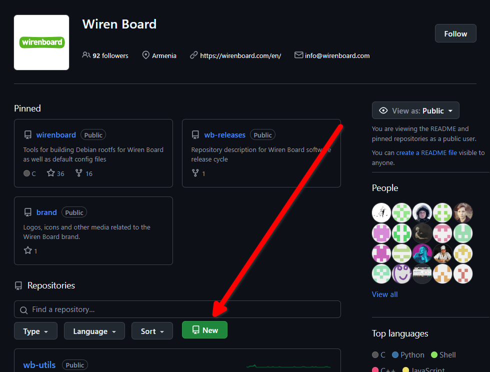

Процесс разработки проектов Wiren Board с использованием Git, Github, Youtrack
============================

Общее
-------------

Процесс построен так: описание задачи в битриксе, работа над кодом в нашем гите на гитхабе.
Работать нужно в ветке в гите, всё коммитить, в конце прибираться и сделать pull-request.
Дальше на этот PR смотрит ответственный человек из числа коллег и либо принимает как есть, либо как-то комментирует и просит изменений.

_Верный сценарий - одна фича/исправление - один PR._

Документирование
-------------------------
Новую функциональность после принятия PR (но до релиза) нужно описать в нашей публичной вики и хорошо протестировать.

Если разработка касается прошивок, то нужно помнить, что железки чаще всего используют с нашим линуксовым контроллером, так что потом с ним тоже надо протестировать.

Стайлгайд
------------
Код пишем одинаково. Что-то по [embedded_C](embedded_c.en.md)/[C++](C%2B%2B.ru.md)/[Python](python.ru.md) описано в .md рядом, что-то выяснится после ревью пулл-реквестов. Если чего-то нет в стайлгайде, то лучше посмотреть как написано рядом.

Создание веток в Git
--------------------

В этом разделе описана работа с ветками _до создания PR_. Работа с ветками, для которых уже создан PR, отличается, смотри следующий раздел.

_Следует писать сообщения коммитам на английском в повелительном наклонении. Образец: "add <что_было_добавлено>" - ок. "add**ed** <что_было_добавлено>" или "<что_было_добавлено> is added" - не ок. Почему так - можно почитать [здесь](https://cbea.ms/git-commit/)._

В гайдлайне работа с git рассматривается на примере **консольного** клиента. _Используя его, при возникновении проблем нагуглить решение / получить консультацию от коллег - сильно проще!_

  1. Получаем последнее состояние ветки `main` (или `master`).
  2. Создаём ветку. Допустимые имена веток:

  - `feature/SOFT-XXXX-my-description` или `bugfix/SOFT-XXXX-my-description` (`XXXX` - номер тикета в youtrack);
  - `feature/my-description` или `bugfix/my-description`, если тикета нет (например, быстро что-то исправили);
  - `tmp/username/my-description` для временных веток.

  3. Делаем что-то в ветке. До того как был создан PR, с веткой можно делать что угодно: перетаскивать (rebase), сливать коммиты и так далее.
     Соответственно, можно делать `git push -f`. Нельзя писать в чужие ветки без согласования с автором. И нет смысла ожидать, что чужая ветка
     будет изменяться предсказуемо, если это не согласовано.

     Если в ветке потребовалось переименовать/переместить файлы и одновременно отредактировать их,
     перемещение нужно сделать отдельным коммитом перед редактированием. Если этого не сделать, Github
     может интерпретировать это изменение как удаление старого файла и создание нового с нуля, а так можно
     будет хотя бы посмотреть изменение в рамках одного коммита.

  4. Перед подготовкой PR нужно сделать следующее:

  - убедиться, что история линейна (ветка - последовательность из одного или нескольких коммитов без мержей с другими ветками, в т.ч. `main` (или `master`));
  - в ветке адекватное количество коммитов (часто достаточно одного, желательно - до 5);
  - каждый коммит имеет смысловую нагрузку и соответствует какому-то атомарному изменению;
  - одно и то же место в коде не должно изменяться разными коммитами;
  - если потребовалось переименование/перемещение файлов, оно должно быть выполнено отдельным коммитом
    до редактирования файла;
  - каждый коммит имеет адекватное описание. Например, `fix some bugs` - плохое описание. В хорошем указано, что изменилось и зачем это нужно,
    идеально было бы сослаться на тикет (по номеру) или обсуждение в техподдержке;
  - очень желательно, чтобы в каждом коммите ветки проект собирался и получалось что-то адекватное;
  - желательно выдерживать хороший баланс между объёмом коммита и его описанием, не стоит делать коммит с `названием добавил режим работы`
    в котором изменения в 10 файлах охватывают и режим работы, и регистры, и сохранение их во флеш, лучше разбить работу каждого модуля с новой функцией
    в отдельный коммиты, такие коммиты приятнее смотреть когда приходится окунуться в историю проекта на пару лет.
  - если проект собирается в deb-пакет или в файл прошивки с версией, то нужно добавить запись в changelog. Это можно сделать в одном коммите с
    изменениями, если их не очень много, или отдельным коммитом в конце. Правила обновления номера версии - semver (https://semver.org/lang/ru/).
    Пиши запись в changelog опрятно и грамотно: потом эта запись появится в релизном changelog-е и будет видна всем пользователям.
  - если проект - прошивка то последним перед мерджем должен быть коммит с сообщением вида change version to: x.x.x с записью в Changelog и изменениями в регистре.
    на данном коммите проект точно должен собираться в соответствующую версию.
  - если в проекте настроена проверка покрытия тестами и в PR добавились тесты, увеличивающие покрытие, необходимо увеличить порог в Jenkinsfile.

    В приведении ветки в порядок помогут эти команды: `git rebase -i` и `git add -p`, можно почитать об этом в мане или в интернете.

    Если строгое деление на коммиты не обязательно и их можно объединить в один перед слиянием, можно не объединять их заранее,
    а просто выполнить слияние кнопкой "Squash and merge". Адекватные описания коммитов и обновление версии пакета всё ещё обязательны.

  5. Создаём PR. После создания PR ветка перестаёт быть только твоей собственностью, и мы начинаем действовать по инструкции из следующего раздела.

Нельзя смешивать в одном PR изменения в функционале и форматировании кода. Их стоит оформлять в виде нескольких отдельных последовательных PR.

Создание нового репозитория на GitHub
-------------------------------------

  ### 1. Получение прав

  Для того, чтобы вы имели возможность создавать PR в открытых репозиториях и
  создавать новые репозитории от имени компании wirenboard - нужно:
  - Создать аккаунт GitHub зарегистрировав его на почту
    компании `*@wirenboard.com`
  - Запросить у непосредственного руководителя, чтобы вас добавили
    в организацию `@wirenboard` и в группу `developers`

  Проверить что вам выдали права можно следующим образом:
  - У вас на личной странице `Your profile`, под вашей аватаркой - появится
    иконка организации wirenboard.
  - На главной странице [wirenboard](https://github.com/wirenboard) появится
    зеленая кнопка "New" - позволяющая вам создать новый репозиторий от имени
    компании.

    

  ### 2. Создание репозитория

  Создать новый репозиторий можно несколькими путями, но самый простой вариант:
  - Перейти на главную страницу WB на GitHub: https://github.com/wirenboard
  - Нажить на зеленую кнопку "New".
  - Название репозитория должно начинаться на `wb-*`, слова отделяются
    с помошью тире, например `wb-embedded-controller`.
    Конкретное название нужно обсудить с владельцем продукта.
  - Добавить `Description` (например из файла дебиан пакета `debian/control`)
  - По умолчанию большая часть репозиториев должна иметь visibility: `Public`.
    Конкретный тип нужно обсудить с владельцем продукта.
  - На данном этапе не добавляем `README` , `.gitignore`, `license`.
  - Нажимаем `Create repository`

  После создания репозитория GitHub покажет вам страницу `Quick setup`
  на которой нам пригадится ссылка `creating a new file`.

  ### 3. Создание первого коммита
  
  Новый репозиторий должен быть пустым - сразу заливать код в main является
  плохой практикой, но создать PR в пустой репозиторий (без файлов) нельзя.
  PR должен иметь diff относительно чего-то, поэтому нужно сначала сделать
  первый коммит, который должен быть максимально пустым и уже относительно
  него будет сделан первый PR с вашими измеренеиями.

  Проше всего сделать первый коммит сразу через WEBUI - нажав на странице
  репозитория ссылку `creating a new file`:
  - Добавить `README.md` (Можно пустой)
  - Сделать коммит с сообщением "Initial commit"
  - Залить первый коммит в main ветку на прямую

  ### 4. Общие настройки репозитория

  Если репозиторий будет содержать правила для wb-rules - заходим в созданный
  репозиторий, справа от слова `About` находим шестеренку, нажимаем на нее:
  - В `Topics` добавляем `wb-rules`
  - Выключить `Packages` и `Environments` с главной страницы (не используем)

  Выбираем сверху вкладку `Settings` для данного репозитория, далее:
  - Выключить `Wikis`, `Issues`, `Projects` (не используем)

  Перейти слева в раздел `Code and automation` -> `Access`:
  - Выключить `Actions` поставив `Disable actions` (кроме репозиториев, которые планируется собирать в GitHub Actions в docker-образы и хранить на ghcr.io; например, веб-сервисы, которые деплоятся через infra в docker-контейнерах)

  ### 5. Настройки доступа

  Для полноценного использования коллегами нового репозитория в разделе
  `Settings` репозитория -> `Access` -> `Collaborators and teams` нужно
  добавить в коллабораторы:
  - Евгения [`@evgeny-boger`](https://github.com/evgeny-boger) c `Admin`
    доступом для администрирования.
  - Команду `@wirenboard/developers` c `Write` доступом для создания PR
    в вашем репозитории.
  - Так же для ревью отделом документации можно (не обязательно) добавить
    команду `@wirenboard/docs` c `Triage` доступом.

  Добавить команду получится только если вы ранее выбрали `Public` доступ
  репозитория. В случае приватного репозитория - прийдется добавлять отдельно
  каждого коллегу.

  ### 6. Защита веток

  Зайти в раздел `Settings` репозитория -> `Code and automation` -> `Branches`
  и добавить два отдельных `Branch protection rules`:
  - В первый раз - нужно нажать на `Add classic branch protection rule`,
    а при последующих будет кнопка `Add rule`
  - Ввести `Branch name pattern` первому правилу `main`, второму `release/*`
  - Включить галочку:
    `Require a pull request before merging` -> (`Require approvals: 1`)
  - По согласованию с командой - можно включить галку разрешающую делать
    только слияния с одним коммитом (с использованием squash). Для этого
    отметьте `Require linear history`.
  - Нажать внизу на зеленую кнопку `Create`.
  
  ### 7. Создание первого PR

  Теперь можно сделать PR - который покажет коллегам что вы добавляете в main.
  Данный коммит уже должен содержать минимум, три составляющих:
  - Файл лицензии `LICENSE`, за основу можно взять следующий файл
    из репозитория `wirenboard/wb-mqtt-serial`:
    [LICENSE](https://github.com/wirenboard/wb-mqtt-serial/blob/master/LICENSE)
  - Дополненный `README.md`
  - Ваш первый реализованный функционал который должен пройти ревью

  Далее нужно опубликовать PR, дождаться проверки со стороны коллег
  и самостоятельнопровести слияние. Подробнее об этом смотрите ниже - в
  секции "Работа с PR".

Работа с PR
-----------

Работа с веткой в PR отличается от обычной работы с веткой, потому что теперь в игру вступают инструменты Github,
которые капризно относятся к изменениям истории.

**Особенности работы с веткой в PR**:

  - **нельзя** менять историю! То есть, запрет на любые действия, кроме добавления коммитов.
    Github может потерять обсуждения, привязанные к коду. Все изменения в рамках PR создаём новыми коммитами,
    не забывая о правилах оформления коммитов из описания выше.

**Жизненный цикл PR**: Открытие PR => ревью и правки => слияние (Merge) => удаление ветки.

  1. **Открытие PR:**

  Нужно добавить ревьювера/ов и описание.
  Цель описания - помочь ревьюверам (даже плохо знакомым с проектом) быстро погрузиться в контекст.

  В описании - концептуально рассказать, что происходит; добавить скриншоты (или gif/видео) было/стало (если изменения в интерфейсе).
  PR без описаний или с плохими описаниями (из которых ревьювер не может войти в контекст) могут быть отправлены ревьювером на
  доработку без заглядывания в код! Пожалуйста, цените время своих коллег.

  - Обязательно надо добавить мейнтейнера пакета (указан в `debian/control`).
  - Если указанный мейнтейнер у нас уже не работает, надо спросить в чате, кто сейчас отвечает за пакет.
  - Если добавляешь ещё кого-то в ревьюверы (например, обсуждал это с кем-то заранее), то в описании PR надо призвать их
    через `@mention` и объяснить, зачем кто-то ещё был добавлен. Например, `@webconn взгляни на изменения в Jenkinsfile`;
  - Github не позволяет добавлять нескольких ревьюверов в приватные репозитории; если это нужно, то одного добавляем явно,
    а остальных призываем в описании, через `@mention`. Добавить своё ревью при этом они смогут без проблем обычными средствами гитхаба.

  2. **Ревью и правки**:

  В это время другие люди смотрят изменения, идёт обсуждение спорных моментов, предлагаются правки.

  - Правки вносятся отдельными коммитами сверху. Можно разделять правки, относящиеся к разным исходным коммитам (чтобы потом привести историю в порядок, если надо).
  - Если в процессе исправлений нужно что-то проверить в сборке на CI (например, починить упавшую сборку или тесты) - стоит использовать для этого временную ветку (вида ``tmp/<username>/<branch_name>``), чтобы не присылать ревьюверам лишних уведомлений. После использования не забыть эту ветку удалить.
 - _Хороший тон_ - отвечать что-то вроде "готово" под комментариями с замечаниями.
  - Не трогать кнопку "Resolve Conversation". Она - для ревьювера.
  - Когда все правки внесены _(не забыть проверить, что проект собирается, запускается и функциональность вокруг вносимых правок работает должным образом)_ - сделать push ветки, из которой открыт PR, и нажать на "re-request review" (сверху в интерфейсе гитхаба; рядом с ревьюверами). **_Напомнить ревьюверам в лс/dev-чат, что пора смотреть_**.

  3. **Слияние (merge)**.

  _Желательный сценарий - одна задача -> одна небольшая фича -> один PR -> один коммит в мастер в итоге._

  Если вдруг нужно сохранить коммиты (нежелательно) - см 3.1*

  - Слияние выполняет автор PR после того, как был получен approve от всех отмеченных ревьюверов.
  - Последний коммит ветки обязательно должен пройти проверку `continuous-integration/jenkins/pr-merge`
    (если настроен CI для репозитория). Если Jenkins ругается - не стесняемся читать логи (внизу страницы "Show all checks" -> "Details" у любого красного крестика -> "Console Output"). Не получилось разобраться быстро - дёргаем ответственных за Jenkins.
  - Вливаем по умолчанию с помощью `Squash and merge` (сольёт все коммиты в один и даст отредактировать описание), написав осмысленное сообщение, отражающее суть проделанного.
  Если ``master/main`` уже убежал - нужно сделать ``git pull origin master`` и порешать merge-конфликты (не забываем про ``git add`` и ``git commit`` после).
  - Если хочется сохранить несколько коммитов в ветке, идём по 3.1*.
  - Сразу удаляй ненужные ветки - не заставляй Jenkins страдать! (на гитхабе после вливания ветки появляется кнопка "Delete Branch" внизу)

3.1* **Слияние с сохранением коммитов (нежелательно)**

Если вдруг надо сохранить несколько коммитов в ветке, то надо проверить, продвинулась ли ветка `main` (или `master`)
за время существования PR, и были ли в PR добавлены коммиты, которые нужно слить с другими.

Если не продвинулась и нет лишних коммитов, то просто выполняем слияние кнопкой `Merge pull request`.

Иначе действуем по следующей инструкции:

  1. Закрываем существующий PR без слияния.
  2. Создаём из исходной ветки новую с именем `<имя ветки>-rebaseX`, где X - номер итерации (начиная с 1) на случай, если понадобится
     несколько раз подряд переносить ветку. Старую ветку теперь обновлять нельзя.
  3. Вносим изменения в историю:

  - получаем последнее состояние `main` (или `master`): `git checkout main && git pull`
  - переходим в нашу исходную ветку: `git checkout feature/XXXXX-my-feature`;
  - создаём в этом месте rebase-ветку: `git checkout -B feature/XXXXX-my-feature-rebaseX`;
  - переносим ветку на вершину `main` (или `master`): `$ git rebase main`;
  - если нужно, сливаем коммиты с правками с исходными коммитами: `$ git rebase -i main`.

  4. Создаём новый PR с новой веткой. Ссылаемся на новый PR в комментариях к старому, оставляем ссылку на старый в новом.
     В общем, наводим связность.
  5. _<сознательность\_моде>_ Если в процессе rebase не было сделано никаких **новых** изменений (например, для решения
    конфликтов с новым `main` (или `master`), то вливать PR можно без ревью. Правила вливания как в первом сценарии.
    Чтобы посмотреть изменения между новой и старой ветками, можно воспользоваться `git diff <имя-старой-ветки>`
    (находясь в этот момент на новой).
  6. Если были внесены изменения, с которыми стоит ознакомиться команде, то нужно добавлять ревьюверов и весь процесс повторяется сначала.

Стабильные версии и релизы
--------------------------

После введения системы регулярных релизов (https://wirenboard.com/wiki/Software_Releases) то, что находится в `main` (или `master`), не является стабильным.

Код с вершины `main` (или `master`) автоматически загружается в `unstable` (и, следовательно, в `testing`, если он не заморожен).

Версия кода становится стабильной после включения её в релизный список и выпуска релиза. В момент выпуска релиза коммит с выпущенной
версией помечается веткой с именем `release/wb-YYYY` (`YYYY` - номер релиза).

Исправления, вносимые в репозиторий после выпуска релиза, должны составлять линейную историю в ветке `release/wb-YYYY`.
Этого можно достичь несколькими способами:

 1. Если исправление вышло сразу после публикации релиза, и ветка `main` (или `master`) находится в той же позиции, что `release/wb-YYYY`,
    то после вливания ветки с исправлением в `main` (или `master`) и добавления новой версии в релизный список, ветка `release/wb-YYYY`
    переносится на новый коммит в `main` (или `master`) (типа fast-forward merge).

В этом случае номер версии изменяется естественным образом согласно semver.

 2. Если после выпуска релиза в `master` оказались изменения, которые не должны попасть в релиз, в месте `release/wb-YYYY` создаётся
    ветка с именем `feature/XXXXX-description/release/wb-YYYY`, в которую вносятся нужные исправления. После этого создаётся PR
    из новой ветки в `release/wb-YYYY`.

Во втором случае номер версии формируется как версия уже выпущенного пакета и суффикс `-wbZ`, где `Z` - номер патча в этот релиз.

Например, если изначально в релиз вошла версия `2.3.4`, но в процессе потребовалось добавить патч в выпущенную версию,
номер новой версии в релизе будет `2.3.4-wb1`. Если в уже пропатченную версию потребовались изменения, то номер новой
версии будет `2.3.4-wb2` и так далее. _В правила нумерации версий в релизах в отдельных случаях могут быть внесены изменения_.

Связь с youtrack
----------------

Настроена связь git и youtrack: ветки с названием X/SOFT-N-Y (например: feature/SOFT-1234-bitrix-integration), автоматически привязываются к задаче с номером N в youtrack.
